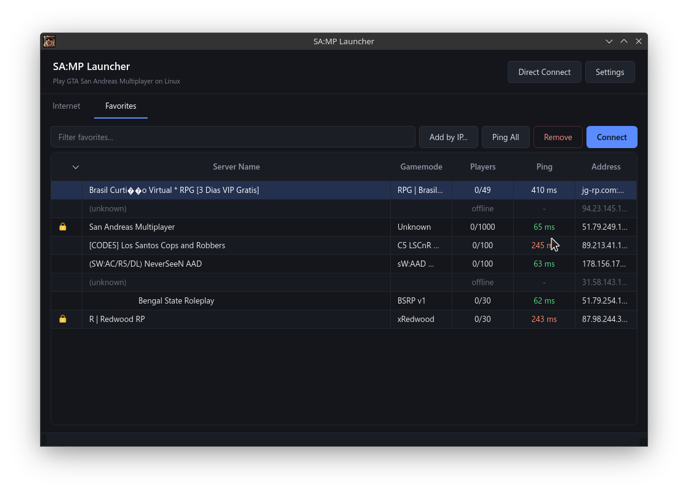

### SA:MP Launcher

A third-party launcher for **GTA San Andreas Multiplayer (SA:MP)** on Linux.  
Because SA:MP itself is a Windows mod (`samp.dll` injected into `gta_sa.exe`), this launcher runs the game through **Wine** — it does not include any game files, it only helps launch an already installed game.



### Features

*   **Internet tab** — fetches the public server list from `api.open.mp/servers` (supports both classic SA:MP and open.mp servers), with search filtering.
*   **Real-time query** — ping, player count, gamemode, and password status are retrieved directly from each server using the official SA:MP UDP query protocol (opcode `i`), the same method used by the original SA:MP launcher.
*   **Favorites tab** — save favorite servers persistently in `~/.local/share/sampqt/favorites.json`, add manual entries by IP:port, remove them, and refresh queries.
*   **Direct Connect** — connect directly to `ip:port` with a password without adding the server to favorites first.
*   **Settings** — configure nickname, GTA San Andreas installation folder, Wine binary (or Proton `run` script), and optional `WINEPREFIX`.
*   Dark, flat, modern UI (custom QSS), sortable table columns.

### Project structure

```
samp-linux/
├── CMakeLists.txt
├── resources.qrc
├── style/style.qss
├── src/
│   ├── main.cpp
│   ├── mainwindow.{h,cpp}       # Main window, all tabs & actions
│   ├── sampquery.{h,cpp}        # SA:MP UDP query protocol
│   ├── serverlistmodel.{h,cpp}  # Server table model
│   ├── favoritesmanager.{h,cpp} # Favorites persistence (JSON)
│   ├── settingsdialog.{h,cpp}   # Settings dialog
│   ├── directconnectdialog.{h,cpp}
│   ├── launcher.{h,cpp}         # Build and run Wine command
│   └── serverinfo.h             # Server data struct
└── packaging/samp-linux.desktop
```

### Build

### Dependencies

* CMake ≥ 3.16
* C++17 compiler (GCC/Clang)
* Wine 32-bit
* Qt 6 (Widgets + Network), Qt ≥ 6.3 for `qt_standard_project_setup()`

Example on Ubuntu/Debian:

```bash
sudo dpkg --add-architecture i386 && sudo apt update
sudo apt install build-essential cmake qt6-base-dev wine32
```

Example on Arch Linux:

> Note: You must enable the `[multilib]` repository in `/etc/pacman.conf` first to get 32-bit Wine support.

```bash
# 1. Open /etc/pacman.conf with a text editor and uncomment these lines:
# [multilib]
# Include = /etc/pacman.d/mirrorlist

# 2. Sync repositories and install the dependencies
sudo pacman -Syu
sudo pacman -S base-devel cmake qt6-base wine wine-mono wine-gecko
```
    
### Compile

```bash
cd samp-linux
cmake -B build -DCMAKE_BUILD_TYPE=Release
cmake --build build -j$(nproc)
```

> The built binary is located at `build/samp-linux`.

Run it with:

```bash
./build/samp-linux
```
   
(Optional) install to the system:

```bash
sudo cmake --install build
```

### Setup before connecting

1.  Install GTA San Andreas + the SA:MP client through Wine (for example with `wine samp-client-installer.exe`), so that `gta_sa.exe` and `samp.exe` are in the same folder.
2.  Open **Settings** in the launcher and fill in:
    *   **Nickname** — your in-game name.
    *   **GTA San Andreas folder** — the folder containing `samp.exe`.
    *   **Wine binary** — usually `wine`. You can also use a path to a Proton or wrapper script.
    *   **WINEPREFIX** (optional) — if your game is installed in a custom Wine prefix (not the default `~/.wine`).
3.  Choose a server from the Internet or Favorites tab, or use Direct Connect, then click **Connect**.

### Technical notes

*   The server list endpoint (`api.open.mp/servers`) is a third-party service maintained by the open.mp community. If the JSON schema changes in the future, parsing in `MainWindow::onMasterListReply()` may need adjustment (the code already handles two possible field shapes defensively).
*   Server ping/info queries are performed 100% directly from the launcher to each server over UDP, not via a third party.
*   This is not an official SA:MP or open.mp product.